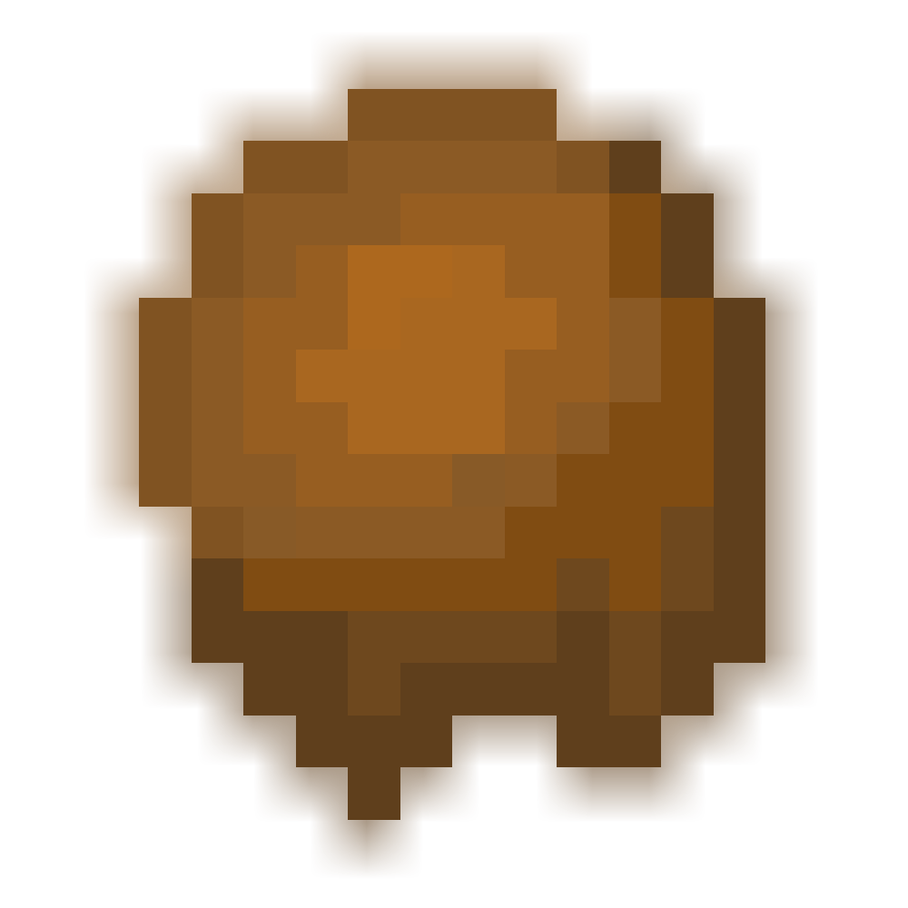

  

<h1 align="center">A Mud Mod</h1>

A Minecraft mod that brings various types of mud to the game while keeping the vanilla feel!

##### Brings mud and packed mud blocks to the game as well as mud balls!

## Features
- Mud Ball
  - Can be thrown like a snowball but is a bit heavier so it won't travel as far.
  - Has minimal knockback and damage but stuns the reciver for a few seconds
  - Gives resistance to players and mobs while they are stunned
- Mud Block
  - Standing leg deep in mud slows the player down and negates fall damage.
  - When fully caked in mud, (when the head is inside mud) you gain the ability to see close objects but the rest of your vision is dark. You do not suffocate in mud.
  - Mud falls with gravity like sand and gravel. Mud will collapse on its self if it is not built block by block. 
 - Packed Mud Block
   - Standing leg deep will greatly slow the player down and negate any fall damage.
   - When fully caked in packed mud, you not only gain the ability to see close objects nearby, but the mud is so strong it gives you Resistance III.
   - Packed mud does not fall with gravity.
   
## Screenshots

Mud ball being thrown at spider

Player caked in packed mud and peeking out at surrounding blocks

A villager is climbing out of a block of mud.

## Versions
Currently this mod is made for Minecraft Forge 1.15.2. A Fabric version for 1.16.3 might be made if MCreator supports it.

## Credits
Created using [MCREATOR](https://mcreator.net/) and a bit of love 💖
